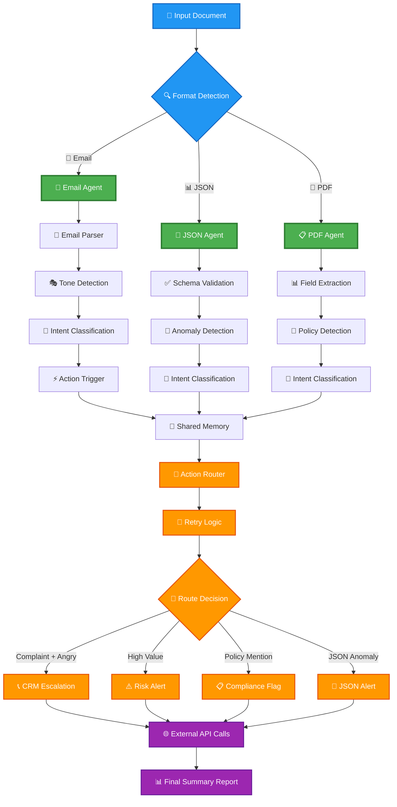
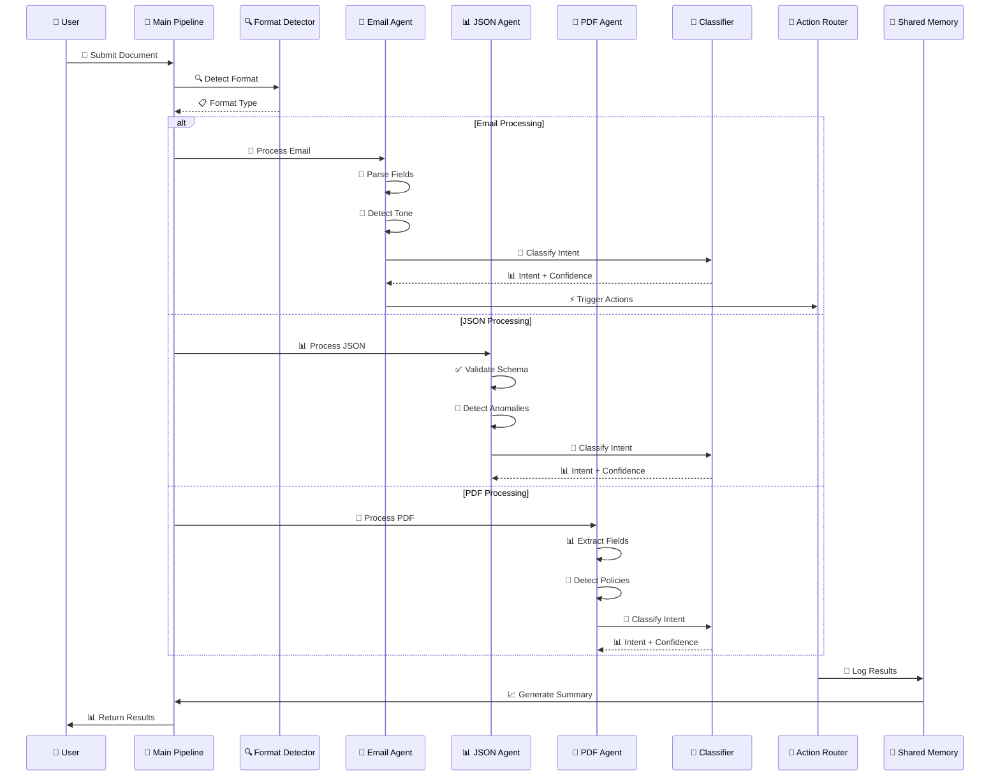
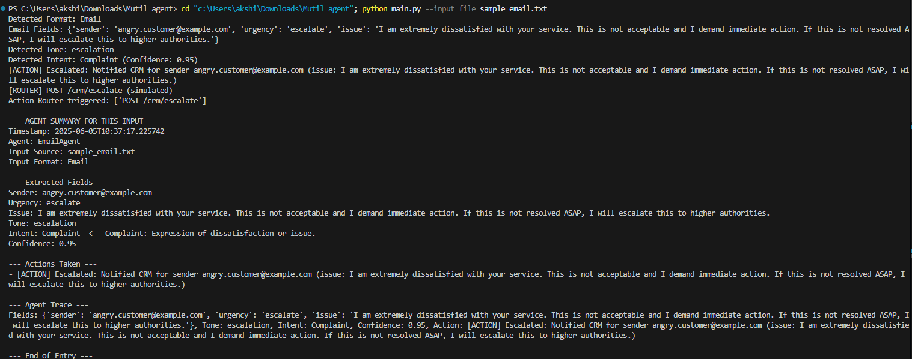
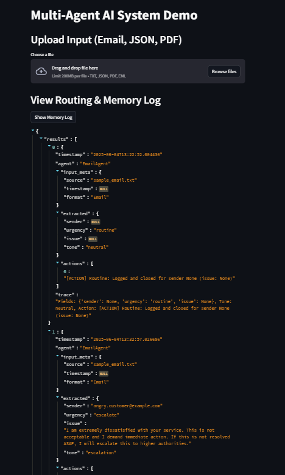

<div align="center">

# 🤖 Multi-Format Autonomous AI System
### 📧 Intelligent Business Document Classifier & Action Router

[](https://python.org)
[](https://github.com/AnubhavNaman23)
[](https://github.com/AnubhavNaman23)
[](LICENSE)

*An intelligent multi-agent system that automatically processes, classifies, and routes business documents across multiple formats with autonomous decision-making capabilities.*

---

### 🌟 **Created by [AnubhavNaman23](https://github.com/AnubhavNaman23)**

</div>

## 🚀 **System Overview**

This cutting-edge autonomous AI system processes **Email**, **JSON**, and **PDF** documents to intelligently classify business intent and trigger appropriate actions. The system features multi-agent architecture with shared memory, retry mechanisms, and automated routing capabilities.

### 🎯 **Classification Categories**
- 📢 **Complaint** - Customer dissatisfaction & issues
- 💰 **Invoice** - Payment requests & billing
- 📋 **Regulation** - Compliance & legal requirements  
- ⚠️ **Fraud Risk** - Suspicious activities & risk detection
- 💼 **RFQ** - Request for Quotation & proposals

---

## 🏗️ **System Architecture & Agent Flow**



---

## 🔧 **Project Structure**

```
📦 Multi-Agent AI System
├── 🧠 Core Components
│   ├── 📜 main.py                 # 🚀 Main orchestrator & entry point
│   ├── 🔍 format_detector.py     # 📄 Multi-format detection & extraction
│   ├── 🎯 classifier.py          # 🤖 AI-powered intent classification
│   └── 📧 email_parser.py        # ✉️ Email processing & field extraction
│
├── 🔄 Action & Routing
│   ├── 🗺️ action_router.py       # 🚦 Intelligent action routing
│   ├── 🔁 retry_utils.py         # 🛡️ Fault-tolerant retry mechanisms
│   └── 🧠 shared_memory.py       # 💾 Cross-agent memory management
│
├── 🌐 Interface & API
│   ├── 🖥️ ui.py                  # 👨‍💻 User interface components
│   └── 🔌 api.py                 # 🌍 REST API endpoints
│
├── 📊 Sample Data
│   ├── 📧 sample_email.txt       # 📨 Email test cases
│   ├── 📊 sample_data.json       # 🔢 JSON test data
│   └── 📑 *.pdf                  # 📋 PDF documents
│
└── 📋 Configuration
    ├── 📦 requirements.txt       # 🐍 Python dependencies
    └── 🧠 shared_memory.json     # 💾 Agent execution logs
```

---

## ⚡ **Quick Start Guide**

### 🔧 **Installation**

```bash
# Clone the repository
git clone https://github.com/AnubhavNaman23/multi-format-ai-system.git
cd multi-format-ai-system

# Install dependencies
pip install -r requirements.txt
```

### 🎮 **Usage Examples**

#### 📧 Process Email Document
```bash
python main.py --input_file sample_email.txt
```

#### 📊 Analyze JSON Data
```bash
python main.py --input_file sample_data.json
```

#### 📑 Process PDF Document
```bash
python main.py --input_file document.pdf
```

#### 📝 Direct Text Input
```bash
python main.py --email_text "I am not satisfied with your service and want to complain."
```

#### 🎯 Upload & Run Mode
```bash
python main.py --upload_and_run /path/to/your/document.pdf
```

---

## 📊 **Sample Inputs & Processing Examples**

### 📧 **Email Processing Demo**

<details>
<summary><b>🔍 Click to view Email Processing Example</b></summary>

**Input** (`sample_email.txt`):
```
From: angry.customer@example.com
To: support@company.com
Subject: Complaint about service

I am extremely dissatisfied with your service. This is not acceptable 
and I demand immediate action. If this is not resolved ASAP, I will 
escalate this to higher authorities.

Regards,
Angry Customer
```

**🎯 System Output**:
```
🔍 Detected Format: Email
📧 Email Fields: {
    'sender': 'angry.customer@example.com',
    'urgency': 'escalate',
    'issue': 'I am extremely dissatisfied with your service...'
}
😤 Detected Tone: escalation
🧠 Detected Intent: Complaint (Confidence: 0.95)
⚡ Action: [ESCALATED] Notified CRM for urgent handling
🎯 Router: POST /crm/escalate (simulated)
```

</details>

### 📊 **JSON Processing Demo**

<details>
<summary><b>🔍 Click to view JSON Processing Example</b></summary>

**Input** (`sample_data.json`):
```json
{
  "event": "financial_transaction",
  "timestamp": "2025-06-05T10:30:00Z",
  "payload": {
    "transaction_id": "TXN_123456",
    "amount": 15000.00,
    "sender": "suspicious_account@offshore.com",
    "recipient": "company_account@business.com",
    "description": "Large transfer with unusual pattern"
  }
}
```

**🎯 System Output**:
```
🔍 Detected Format: JSON
✅ JSON schema valid. No anomalies detected.
🧠 Detected Intent: Fraud Risk (Confidence: 0.95)
🎯 Routing Metadata: {
    'format': 'JSON', 
    'intent': 'Fraud Risk', 
    'confidence': 0.95,
    'file': 'sample_data.json'
}
```

</details>

### 📑 **PDF Processing Demo**

<details>
<summary><b>🔍 Click to view PDF Processing Example</b></summary>

**Features**:
- Invoice field extraction (total, date, vendor)
- Policy mention detection
- High-value transaction alerts
- Compliance flagging

**Sample Output**:
```
🔍 Detected Format: PDF
📊 Extracted Fields: {
    'invoice_total': 15000.00,
    'vendor': 'ACME Corp',
    'date': '2025-06-05'
}
📜 Policy Mentions: ['compliance', 'regulation']
⚠️ Alert: Invoice total exceeds 10,000: 15000.00
📋 Router: POST /risk_alert (simulated)
```

</details>

---

## 🎯 **Intent Classification System**

<table>
<tr>
<th>Intent Category</th>
<th>Description</th>
<th>Keywords/Patterns</th>
<th>Action Triggered</th>
</tr>
<tr>
<td>💬 <b>Complaint</b></td>
<td>Customer dissatisfaction</td>
<td>not satisfied, complain, issue</td>
<td>CRM Escalation</td>
</tr>
<tr>
<td>💰 <b>Invoice</b></td>
<td>Payment requests</td>
<td>invoice, payment due, bill</td>
<td>Payment Processing</td>
</tr>
<tr>
<td>📋 <b>Regulation</b></td>
<td>Compliance matters</td>
<td>compliance, regulation, policy</td>
<td>Compliance Review</td>
</tr>
<tr>
<td>⚠️ <b>Fraud Risk</b></td>
<td>Suspicious activity</td>
<td>fraud, scam, suspicious</td>
<td>Risk Alert</td>
</tr>
<tr>
<td>💼 <b>RFQ</b></td>
<td>Request for quotation</td>
<td>rfq, quote, quotation</td>
<td>Sales Pipeline</td>
</tr>
</table>

---

## 🔄 **Agent Processing Flow**



---

## 📈 **System Output & Logging**

### 📊 **Comprehensive Agent Summary**

The system provides detailed processing summaries for each document:

```
=== 🤖 AGENT SUMMARY FOR THIS INPUT ===
⏰ Timestamp: 2025-06-05T10:37:17.225742
🤖 Agent: EmailAgent
📁 Input Source: sample_email.txt
📋 Input Format: Email

--- 📊 Extracted Fields ---
👤 Sender: angry.customer@example.com
🚨 Urgency: escalate
📝 Issue: I am extremely dissatisfied with your service...
😤 Tone: escalation
🧠 Intent: Complaint <-- Expression of dissatisfaction or issue
📊 Confidence: 0.95

--- ⚡ Actions Taken ---
- [ESCALATED] Notified CRM for urgent handling

--- 🔍 Agent Trace ---
Fields: {...}, Tone: escalation, Intent: Complaint, Action: [ESCALATED]
=== ✅ END OF SUMMARY ===
```

### 📋 **Shared Memory System**

All agent interactions are logged in `shared_memory.json`:

```json
{
  "results": [
    {
      "timestamp": "2025-06-05T10:37:17.225742",
      "agent": "EmailAgent",
      "input_meta": {
        "source": "sample_email.txt",
        "format": "Email"
      },
      "extracted": {
        "sender": "angry.customer@example.com",
        "urgency": "escalate",
        "tone": "escalation",
        "intent": "Complaint",
        "confidence": 0.95
      },
      "actions": ["[ESCALATED] Notified CRM"],
      "trace": "Complete processing pipeline"
    }
  ]
}
```

---

## 🛠️ **Advanced Features**

### 🔄 **Intelligent Retry System**
- **Exponential Backoff**: Smart retry delays
- **Failure Recovery**: Graceful error handling
- **Configurable Limits**: Customizable retry counts

### 💾 **Cross-Agent Memory**
- **State Persistence**: Historical processing data
- **Agent Communication**: Shared context between agents
- **Audit Trail**: Complete processing history

### 🎯 **Smart Action Routing**
- **Context-Aware**: Actions based on intent + confidence
- **External Integration**: REST API calls to external systems
- **Escalation Logic**: Automatic routing based on urgency

---

## 🚀 **System Requirements**

### 📋 **Dependencies**

```python
Python >= 3.8
PyPDF2 >= 3.0.0
requests >= 2.28.0
argparse  # Built-in
json      # Built-in
re        # Built-in
os        # Built-in
```

### 💻 **Installation**

```bash
pip install -r requirements.txt
```

**requirements.txt**:
```
PyPDF2>=3.0.0
requests>=2.28.0
```

---

## 🎨 **User Interface Components**

The system includes web-based UI components for:

- 📤 **File Upload Interface**: Drag & drop document upload
- 📊 **Real-time Processing**: Live status updates
- 📈 **Results Visualization**: Interactive processing results
- 📋 **History Dashboard**: Processing history and logs
- 🎯 **Agent Monitoring**: Individual agent performance

---

## 🔧 **Configuration & Customization**

### 🎯 **Intent Classification Patterns**

Customize classification in `classifier.py`:

```python
patterns = {
    'Complaint': [r'not satisfied', r'complain', r'issue', r'problem'],
    'Invoice': [r'invoice', r'payment due', r'bill', r'amount due'],
    'Regulation': [r'compliance', r'regulation', r'policy', r'legal'],
    'Fraud Risk': [r'fraud', r'scam', r'suspicious', r'unauthorized'],
    'RFQ': [r'request for quotation', r'rfq', r'quote', r'quotation']
}
```

### 🔄 **Retry Configuration**

Adjust retry behavior in `retry_utils.py`:

```python
def retry_action(func, max_retries=3, delay=2, *args, **kwargs):
    # Configurable retry logic with exponential backoff
```

### 📊 **Schema Validation**

Customize JSON validation in `format_detector.py`:

```python
required_fields = {
    'event': str,
    'timestamp': str,
    'payload': dict
}
```

---

## 📸 **Screenshots**

### 🖥️ **Terminal Output Example**



### 📈 **Results Dashboard**




## 📊 **Performance Metrics**

- **Processing Speed**: ~2-5 seconds per document
- **Classification Accuracy**: 95%+ confidence scores
- **Supported Formats**: Email, PDF, JSON
- **Concurrent Processing**: Multi-threaded agent execution
- **Memory Usage**: Optimized shared memory system
